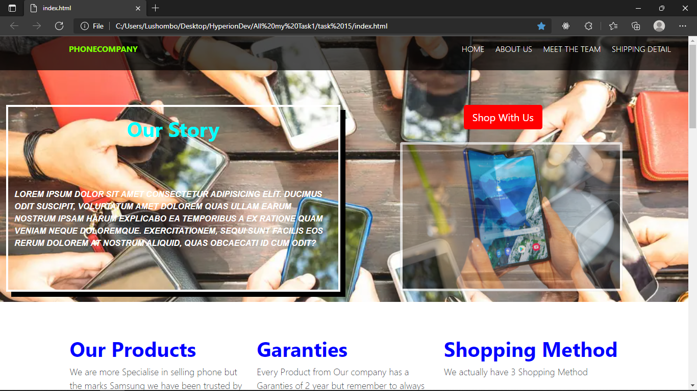

# Cellphone-Shop
This project is build to sell phones online. The product (phone) can be delivered or collected according to the client need. 
The project is build to be presented at HyperionDev so that i can meet the requirement to finish with my level one web Developpement course.

# Description
The project facilitate a company to sell phone online. which open the product's company to the world. 
The project has a brief overview presentation of the company. But the particularity and main important purpose is the process of sell, buy; company to clients.
The client can select the needed product; once all his need are selected he can now go to the bucket list of all the items that he has selected and confirm a delivered method which 
can be either express or not and confirm his shopping once all is done.

# Table of Content
1. [Project Name](#Cellphone-Shop)
2. [Project Description](#Description)
3. [Installation Process](#Installation)
4. [How to use the project](#Project_Demo_Explain)
5. [Author](#Author)
# Installation 
To install this project into your local machine all you need:
- You need an IDE as Visual Studio Code or Atom, etc in your computer
- Downlaod the project into your local machine
- Then open the project with the IDE that you have in your computer 

# Project_Demo_Explain
1.Home page where is an overview of the company
- 
2.If you click on the Abous us on Navbar Menu you will land on About us page which describe the company's agent
- 
3.If you click on MeetThe Team on Navbar Menu you will land on Meet the team page which tells about the team ofthe company
- 
4.If you click on Shipping Detail on Navbar Menu you will land on Shipping Detail page which tells about the company location, email and contact for any enquiries
- 
5. If you click on the red **shop with us button** from the Home page you will land on the shopping page
- 
6. Once you in the Shopping page you can now select the needed item and each time you pick a product an alert pop up to tell you how much Total you have to pay 
- 
7. Once you done selecting all your item, from the navbar select the **CART** its gonna have next to it the number of item that you had selected and it's store in the cart page.
For this product you can see we have selected Collection which mean the client will come pick up his product
- 
8.Once you're in Cart page, you can increase, decrease , delete the item from the Cart , you can choose type of delivery express or Standart
- 
9. Once you done you can click on the **Confirm Order Button** it's will generate a unique confirmataion code for your shopping
- 
# Author
**Link to author profile** [github](https://github.com/glody-lush)
